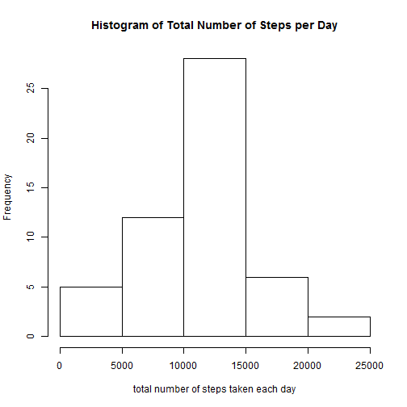
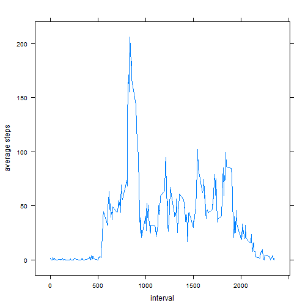
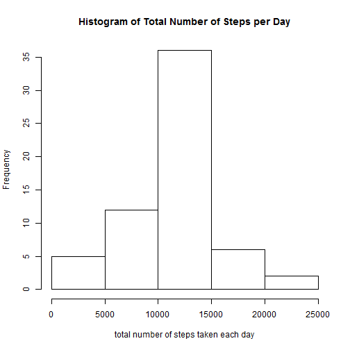

```
## data.table 1.9.2  For help type: help("data.table")
```
###Loading and preprocessing the data
Load the data and transform it into a format suitable for analysis.


```r
data<-read.csv("repdata-data-activity/activity.csv")
complete_data <-data[complete.cases(data),]
```


###What is mean total number of steps taken per day?
1. Make a histogram of the total number of steps taken each day.

```r
dt <- data.table(complete_data)[,list( totalSteps=sum(steps)),by=date]
hist(dt$totalSteps, main="Histogram of Total Number of Steps per Day", xlab = "total number of steps taken each day")
```

 

2. Calculate and report the mean and median total number of steps taken per day.

```r
mean <- mean(dt$totalSteps)
median <- median(dt$totalSteps)
```
The mean is: **1.0766 &times; 10<sup>4</sup>** 

The median is: **10765** 


###What is the average daily activity pattern?
1. Make a time series plot of the 5-minute interval and the average number of steps taken, averaged across all days.


```r
#let the x-axis be interval and y-axis be average steps.
dt <- data.table(complete_data)[,list( avgSteps=mean(steps)),by=interval]
xyplot(avgSteps ~ interval, dt ,type="l", ylab="average steps")
```

 

2. Which 5-minute interval, on average across all the days in the dataset, contains the maximum number of steps?

```r
#find the row with maximum average steps.
dMax <- dt[which.max(dt$avgSteps)]
maxInterval <- dMax$interval[1]
```
We calculated that the interval with the max average steps is at **835**


###Inputing missing values

1. Calculate and report the total number of missing values in the dataset (i.e. the total number of rows with NAs)

```r
incompletes <- sum(!complete.cases(data))
```
There are **2304** amount of missing values in the dataset.


2. Devise a strategy for filling in all of the missing values in the dataset. The strategy does not need to be sophisticated. For example, you could use the mean/median for that day, or the mean for that 5-minute interval, etc.

Here, I'll use the mean of the 5 minute interval to fill in the missing values.


3. Create a new dataset that is equal to the original dataset but with the missing data filled in.

```r
setkey(dt,interval)
data2 <- data
for(i in 1:nrow(data)){
  if(is.na(data[i,"steps"])){
    curInterval <- data[i,"interval"]
    data2[i,"steps"] = dt[J(curInterval)]$avgSteps
  }
}
```
**data2** became our new dataset.


4. Make a histogram of the total number of steps taken each day and Calculate and report the mean and median total number of steps taken per day. Do these values differ from the estimates from the first part of the assignment? What is the impact of imputing missing data on the estimates of the total daily number of steps?


```r
dt <- data.table(data2)[,list( totalSteps=sum(steps)),by=date]
hist(dt$totalSteps, main="Histogram of Total Number of Steps per Day", xlab = "total number of steps taken each day")
```

 

```r
mean <- mean(dt$totalSteps)
median <- median(dt$totalSteps)
```
The mean is: **1.0766 &times; 10<sup>4</sup>** 

The median is: **1.0766 &times; 10<sup>4</sup>** 

The impact of inputing in the missing values is small by observing the histograms and the mean and median.

###Are there differences in activity patterns between weekdays and weekends?

1. Create a new factor variable in the dataset with two levels ¡V ¡§weekday¡¨ and ¡§weekend¡¨ indicating whether a given date is a weekday or weekend day.


```r
dt2 <- data.table(data2)[,list(date=date,interval=interval,steps=steps,day="weekday")]

sat = weekdays(as.Date("2014-07-26"))
sun = weekdays(as.Date("2014-07-27"))

#find the weekends
for(i in 1:nrow(data)){
  d <- as.Date(dt2[i,date])
  if(weekdays(d)==sat || weekdays(d)==sun){
      dt2[i,"day"] <- "weekend"
  }
}
```

2. Make a panel plot containing a time series plot (i.e. type = "l") of the 5-minute interval (x-axis) and the average number of steps taken, averaged across all weekday days or weekend days (y-axis). The plot should look something like the following, which was creating using simulated data:


```r
#let the x-axis be interval and y-axis be average steps.

dt2 <- data.table(dt2)[,list(date=date, avgSteps=mean(steps)),by=list(interval,day)]
xyplot(avgSteps ~ interval | day,  data = dt2, type="l",layout=c(1,2))
```

 
